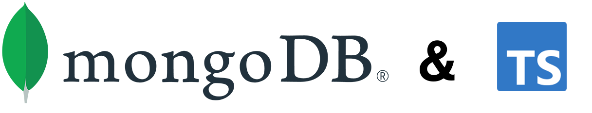

## Introduction

Welcome to this MongoDB and TypeScript sample project.
The aim of this project is to give you a working example of how you can use the power of MongoDB Atlas with TypeScript and Express to create modern web applications.

## Branches

This repository has two branches 'main' and 'finish'.

- 'main' contains the boilerplate code to get you started, following the instructions in the companion blog post - [How to Use TypeScript with MongoDB Atlas](https://www.mongodb.com/compatibility/using-typescript-with-mongodb-tutorial).
- 'finish' contains a working example complete with CRUD operations and schema validation. This is how 'main' will look after following the tutorial. This also gives a working example for anyone looking for a final copy and not intending to follow the post.
