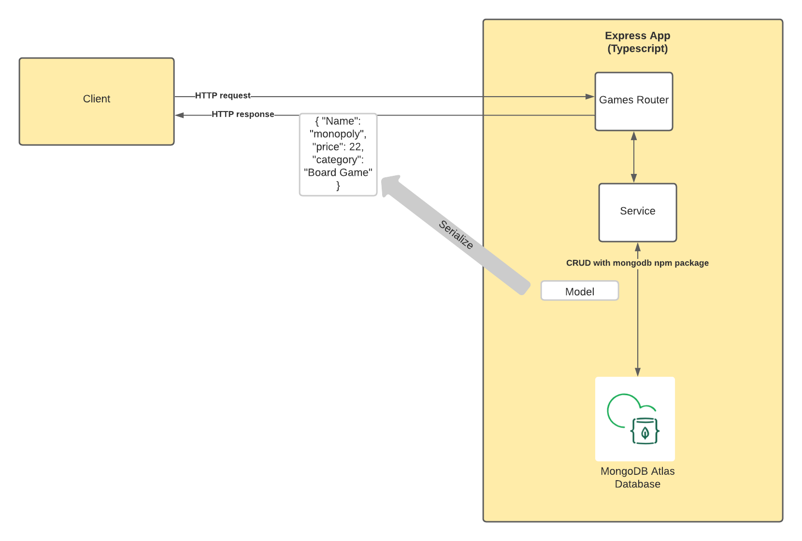

<!-- Modifications Copyright 2023 Tigris Data Inc. -->

# Tigris MongoDB compatibility and TypeScript example

## Introduction

Welcome to this Tigris MongoDB compatibility and TypeScript example app.
This repo aims to give you a working example of how you can use the power of Tigris MongoDB compatibility with TypeScript and Express to create modern web applications.

This repository is a fork of the [MongoDB TypesScript example repo](https://github.com/mongodb-developer/mongodb-typescript-example) with some README updates and a minor configuration change required to use the sample with Tigris.

## Prerequisites

-   [Node.js](https://nodejs.org/en/download/) LTS or higher
-   A [Tigris Cloud account](https://console.preview.tigrisdata.cloud/signup?utm_source=github&utm_medium=github&utm_campaign=tigris-mongodb-typescript-example) or you can [self-host Tigris](https://www.tigrisdata.com/docs/concepts/platform/self-host/?utm_source=github&utm_medium=github&utm_campaign=tigris-mongodb-typescript-example)

## Running the example app

Create a project in Tigris, create an application key, and copy the Client ID and Client Secret values for use in a `.env` file. Then:

1. Create a `.env` file in the root of the app with the same properties as `env.example`
2. Update the values with your connection string, database name, and collection name

Install the app dependencies:

```shell
npm i
```

Run the app:

```shell
npm start
```

### Try out the app

Create a new Game:

```shell
curl --location --request POST 'http://localhost:8080/games' \
--header 'Content-Type: application/json' \
--data-raw '{
   "name": "Fable Anniversary",
   "price": 4.99,
   "category": "Video Game"
}'
```

List Games:

```shell
curl --location --request GET 'http://localhost:8080/games'
```

Get a single Game:

```shell
curl --location --request GET 'http://localhost:8080/games/{_id}'
```

Delete a Game:

```shell
curl --location --request DELETE 'http://localhost:8080/games/{_id}'
```

## Getting to know the code

The below diagram shows the overall architecture of the diagram and the following sections will explain the code.



### Games Router

The `src/routes/games.router.ts` class uses Express's Router functionality. It defines the endpoints available to clients for the Create, Read, Update and Delete (CRUD) operations and then communicates with the database via the [MongoDB NodeJS Driver](https://github.com/mongodb/node-mongodb-native).

### Database Service

The `src/services/database.service.ts` class implements the connection the database. This is also where schema validation is applied to the collection at database level.

### Models

TypeScript is an optionally statically typed language that allows for taking advantage of object-orientated programming. The games.ts class creates a class that defines the properties and data types expected in our document. We use this model throughout the code to enjoy the benefits of typed objects.

## More information

If you want more information about [Tigris, the open source alternative to MongoDB Atlas](https://www.tigrisdata.com?utm_source=github&utm_medium=github&utm_campaign=tigris-mongodb-typescript-example), you can view [the Tigris documentation](https://www.tigris.com/docs/?utm_source=github&utm_medium=github&utm_campaign=tigris-mongodb-typescript-example).

Get involved with Tigris by [joining the Tigris Discord](https://www.tigrisdata.com/discord/?utm_source=github&utm_medium=github&utm_campaign=tigris-mongodb-typescript-example)
