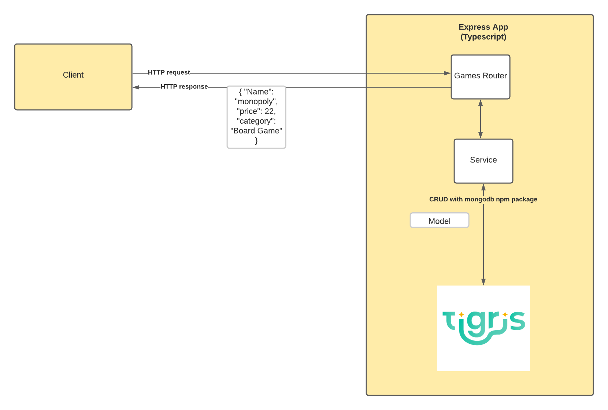

## Introduction

Welcome to this MongoDB and TypeScript sample project.
The aim of this project is to give you a working example of how you can use the power of MongoDB Atlas with TypeScript and Express to create modern web applications.

## Running the project

In order to run this project:

1. Create a `.env` file in the root of the project with the same properties as `env.example`
2. Update the values with your connection string, database name and collection name
3. Run `npm i` to install all dependencies listed in `package.json`
3. Run `npm start`

## Branches

This repository has two branches `main` and `finish`.

- `main` contains the boilerplate code to get you started, following the instructions in the companion blog post - [How to Use TypeScript with MongoDB Atlas](https://www.mongodb.com/compatibility/using-typescript-with-mongodb-tutorial).
- `finish` contains a working example complete with CRUD operations and schema validation. This is how `main` will look after following the tutorial. This also gives a working example for anyone looking for a final copy and not intending to follow the post.

## Getting to know the code

The below diagram shows the overall architecture of the diagram and the following sections will explain the code.

### Games Router

The games.router.ts class uses Express's Router functionality. It defines the endpoints available to clients for the Create, Read, Update and Delete (CRUD) operations and then communicates with the database via the MongoDB NodeJS Driver.

### Database Service

The database.service.ts class implements the connection the database. This is also where schema validation is applied to the collection at database level.

### Models

TypeScript is an optionally statically typed language that allows for taking advantage of object-orientated programming. The games.ts class creates a class that defines the properties and data types expected in our document. We use this model throughout the code to enjoy the benefits of typed objects.

## More information

If you want more information about MongoDB and Atlas, the powerful cloud-based database solution, you can view [the documentation](https://docs.atlas.mongodb.com/).

## Disclaimer

Use at your own risk; not a supported MongoDB product.
